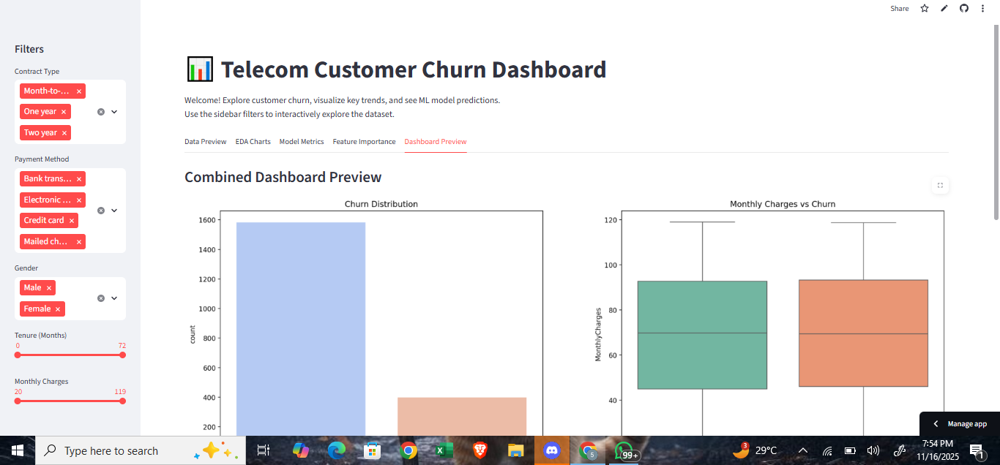

#  Telecom Customer Churn Dashboard

This project is a **fully interactive dashboard** built with **Streamlit** for analyzing telecom customer churn.  
It allows users to explore the dataset, visualize trends, and see predictions from a **Random Forest classifier**.

---

##  Dataset
The dataset contains telecom customer information including:

- CustomerID
- Gender
- SeniorCitizen
- Partner
- Dependents
- Tenure
- PhoneService, MultipleLines
- InternetService, OnlineSecurity, OnlineBackup, DeviceProtection, TechSupport, StreamingTV, StreamingMovies
- Contract
- PaperlessBilling
- PaymentMethod
- MonthlyCharges
- TotalCharges
- Churn (Target variable)

_Source: Kaggle Telecom Churn Dataset_

##  Features

1. **Interactive Filters**:
   - Contract type, Payment method, Gender
   - Tenure and Monthly Charges sliders

2. **Data Preview**:
   - View filtered dataset
   - Quick statistics

3. **EDA Charts**:
   - Churn distribution
   - Tenure vs Churn
   - Monthly Charges vs Churn

4. **ML Predictions**:
   - Random Forest classifier
   - Confusion matrix, ROC curve
   - Download predicted results

5. **Feature Importance**:
   - Ranking of features based on impact on churn

## Dashboard Preview

Click the image below to explore the live interactive dashboard:

## ⚡ How to Run

1. **Clone the repo**:

<pre>bash
git clone https://github.com/yourusername/churn-dashboard.git</pre>

2. **Navigate to the folder**

<pre>cd churn-dashboard</pre>

3. **Install dependencies:**

<pre>pip install -r requirements.txt</pre>

4. **Run Streamlit app:**

   <pre>streamlit run app.py</pre>

# Technologies Used

-Python 3

-Pandas, NumPy

-Matplotlib, Seaborn

-Scikit-learn

-Streamlit

## Dataset

The dataset includes:

-Customer demographics, contract, and payment info

-Service usage details, tenure, monthly charges

-Churn label (Yes/No)

CSV file: telecom_churn_dataset.csv included in repo

## Author

Abdulmuiz Shittu

   -Portfolio-ready project demonstrating data analysis, visualization, and ML modeling

   -Streamlit dashboard showcases interactive data exploration and predictions
